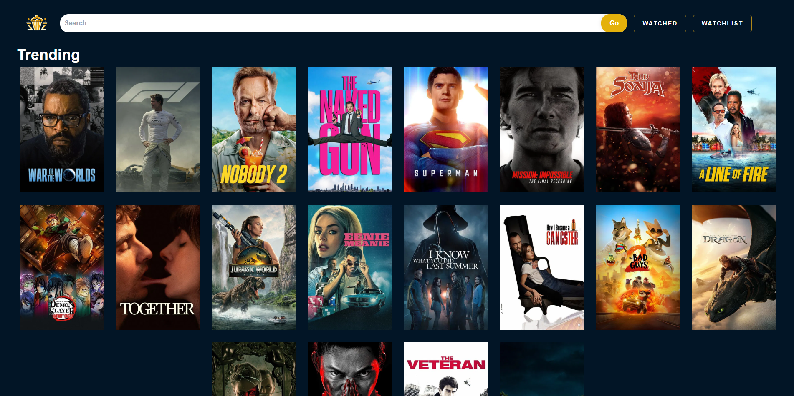
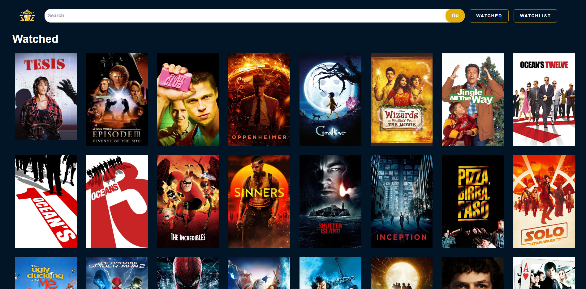

  
# 🍿 VZ MOVIES 
 
    
   
*Tmdb API*  
*si tenes ganas de usar la api acá esta su documentación [TMDB API](https://developer.themoviedb.org/reference/intro/getting-started)*

### '/'

### '/watched'

### '/watchlist'

### '/search'

### '/movie/:id'

